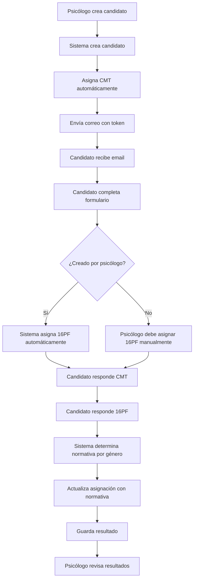
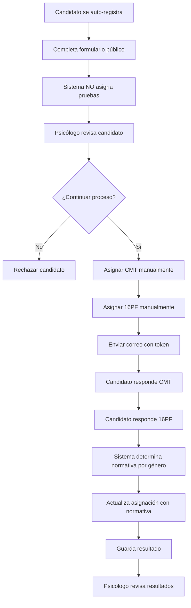

# Panel de Psicólogos - Guía de Integración Frontend

## Descripción General

Este documento describe la integración del panel administrativo de psicólogos para la gestión de candidatos y asignación de pruebas psicotécnicas (CMT y 16PF).

---

## 📋 Sección: Gestión de Candidatos

### Endpoint Base
```
Base URL: /api/Candidatos
```

---

## 1. Listar Candidatos

### `GET /api/Candidatos`

Obtiene la lista completa de candidatos activos.

**Query Parameters:**
- `requerimientoId` (opcional): Filtra candidatos por requerimiento específico

**Respuesta exitosa (200):**
```json
{
  "success": true,
  "data": [
    {
      "canId": 1,
      "requerimientoId": 5,
      "cedulaCiudadania": "1234567890",
      "nombreCompleto": "Juan Pérez",
      "email": "juan.perez@example.com",
      "telefono": "3001234567",
      "token": "a1b2c3d4e5f6...",
      "estado": {
        "estId": 2,
        "estCodigo": "CAND_FORMULARIO_COMPLETO",
        "estDescripcion": "Candidato con formulario completo",
        "estActivo": true
      },
      "linkEnviado": true,
      "fechaEnvioLink": "2025-11-20T10:00:00Z",
      "formularioCompletado": true,
      "fechaCompletado": "2025-11-20T11:30:00Z",
      "resultadoSeleccion": null,
      "motivoRechazo": null,
      "fechaResultado": null,
      "usuarioResultado": null,
      "fechaCreacion": "2025-11-20T09:00:00Z",
      "formulario": {
        "forId": 1,
        "candidatoId": 1,
        "estadoCivil": "Soltero",
        "genero": "Masculino",
        "edadIngreso": 25,
        "municipio": "Medellín",
        "comuna": "10",
        "barrio": "Laureles",
        "direccion": "Calle 45 # 23-10",
        "estrato": 3,
        "tieneHijo": false,
        "cantidadHijo": 0,
        "edadesHijos": [],
        "tallaCamisa": "M",
        "tallaPantalon": "32",
        "tallaZapato": "42",
        "habilidades": "Excel, comunicación efectiva",
        "urlHojaVida": "https://bucket.s3.amazonaws.com/hojas-vida/cv-juan.pdf"
      },
      "documentos": [],
      "asignacionCmt": {
        "asignacionId": 10,
        "estadoAsignacion": "COMPLETADA",
        "fechaAsignacion": "2025-11-20T10:30:00Z",
        "fechaLimite": "2025-12-20T10:30:00Z",
        "tipoNormativa": {
          "tipTipoNormativaId": 1,
          "tipNombre": "Masculino - CMT",
          "tipDescripcion": "Normativa masculina para prueba CMT",
          "tipActivo": true
        },
        "pruebaCompletada": true
      }
    }
  ]
}
```

---

## 2. Crear Candidato (Psicólogo)

### `POST /api/Candidatos`

Crea un candidato desde el panel administrativo y asigna automáticamente el test CMT.

**Request Body:**
```json
{
  "requerimientoId": 5,
  "cedulaCiudadania": "1234567890",
  "nombreCompleto": "María González",
  "email": "maria.gonzalez@example.com",
  "telefono": "3009876543",
  "tipoNormativaId": 2
}
```

**Campos:**
- `requerimientoId` (opcional): ID del requerimiento/vacante
- `cedulaCiudadania` (requerido): Cédula de ciudadanía
- `nombreCompleto` (requerido): Nombre completo del candidato
- `email` (requerido): Correo electrónico
- `telefono` (requerido): Número de teléfono
- `tipoNormativaId` (opcional): ID del tipo de normativa para el CMT (1=Masculino, 2=Femenino, etc.)

**Respuesta exitosa (200):**
```json
{
  "success": true,
  "message": "Candidato creado exitosamente",
  "data": {
    "canId": 15,
    "nombreCompleto": "María González",
    "email": "maria.gonzalez@example.com",
    "token": "x9y8z7w6v5u4...",
    "estado": {
      "estCodigo": "CAND_REGISTRADO",
      "estDescripcion": "Candidato registrado"
    },
    "linkEnviado": true,
    "fechaEnvioLink": "2025-11-20T14:00:00Z"
  }
}
```

### 🔄 Flujo Automático al Crear Candidato:

1. ✅ **Se crea el candidato** con estado `CAND_REGISTRADO`
2. ✅ **Se asigna CMT automáticamente** con la normativa especificada
3. ✅ **Se envía correo** con token de acceso al candidato
4. ⏳ **Test 16PF se asigna después** cuando el candidato complete el formulario

---

## 3. Asignar Test CMT Manualmente

### `POST /api/Candidatos/{id}/asignar-cmt`

Asigna manualmente el test CMT a un candidato (útil para candidatos de registro público).

**Path Parameters:**
- `id`: ID del candidato

**Request Body:**
```json
{
  "tipoNormativaId": 1
}
```

**Campos:**
- `tipoNormativaId` (opcional): ID del tipo de normativa (1=Masculino CMT, 2=Femenino CMT, etc.)

**Respuesta exitosa (200):**
```json
{
  "success": true,
  "message": "Test CMT asignado exitosamente",
  "data": {
    "asignacionId": 25,
    "estadoAsignacion": "PENDIENTE",
    "fechaAsignacion": "2025-11-20T15:00:00Z",
    "fechaLimite": "2025-12-20T15:00:00Z",
    "tipoNormativa": {
      "tipTipoNormativaId": 1,
      "tipNombre": "Masculino - CMT",
      "tipDescripcion": "Normativa masculina para prueba CMT"
    },
    "pruebaCompletada": false
  }
}
```

---

## 4. Asignar Test 16PF Manualmente

### `POST /api/Candidatos/{id}/asignar-16pf`

Asigna manualmente el test 16PF a un candidato.

**Path Parameters:**
- `id`: ID del candidato

**Request Body:**
```json
{}
```
*Nota: El body puede ir vacío. La normativa se determina automáticamente por género.*

**Respuesta exitosa (200):**
```json
{
  "success": true,
  "message": "Test 16PF asignado exitosamente al candidato",
  "data": {
    "candidatoId": 15,
    "asignacionId": 30,
    "estado": "PENDIENTE",
    "fechaAsignacion": "2025-11-20T16:00:00Z",
    "fechaLimite": "2025-12-20T16:00:00Z",
    "notaNormativa": "Se aplicará normativa femenina (determinada automáticamente)"
  }
}
```

### 🎯 Normativa Automática 16PF:

La normativa del test 16PF **NO se especifica manualmente**. Se determina automáticamente de la siguiente manera:

1. **En la asignación:** Se guarda `NULL` en `tipoNormativaId`
2. **Al responder el test:** El sistema lee el género del formulario del candidato
3. **Determinación:**
   - Si género = "Masculino" → Busca tipo de normativa "Masculino - 16PF"
   - Si género = "Femenino" → Busca tipo de normativa "Femenino - 16PF"
4. **Trazabilidad:** El tipo de normativa determinado se actualiza automáticamente en la asignación

**Ejemplo de logs:**
```
[INFO] Tipo de normativa seleccionado automáticamente para candidato 15: Femenino - 16PF (género: F)
[INFO] Tipo de normativa 2 registrado en asignación 16PF para candidato 15 (trazabilidad)
```

---

## 5. Ver Detalle de Candidato

### `GET /api/Candidatos/{id}`

Obtiene información detallada de un candidato específico.

**Path Parameters:**
- `id`: ID del candidato

**Respuesta:** Igual estructura que el listado, con toda la información del candidato.

---

## 🎨 Componentes UI Sugeridos

### Tabla de Candidatos

```jsx
<CandidatosTable>
  <Column field="canId" header="ID" />
  <Column field="nombreCompleto" header="Nombre" />
  <Column field="cedulaCiudadania" header="Cédula" />
  <Column field="email" header="Email" />
  <Column field="estado.estDescripcion" header="Estado" />
  <Column field="formularioCompletado" header="Formulario" template={BooleanBadge} />
  <Column header="CMT" template={PruebaEstadoBadge} data="asignacionCmt" />
  <Column header="16PF" template={Prueba16pfEstadoBadge} />
  <Column header="Acciones" template={AccionesTemplate} />
</CandidatosTable>
```

### Badge de Estado de Prueba CMT

```jsx
function PruebaEstadoBadge({ asignacionCmt }) {
  if (!asignacionCmt) {
    return <Badge severity="secondary">No asignado</Badge>;
  }
  
  const { estadoAsignacion, fechaLimite, pruebaCompletada } = asignacionCmt;
  
  if (pruebaCompletada) {
    return <Badge severity="success">✓ Completada</Badge>;
  }
  
  if (new Date(fechaLimite) < new Date()) {
    return <Badge severity="danger">⚠ Expirada</Badge>;
  }
  
  return <Badge severity="warning">⏳ Pendiente</Badge>;
}
```

### Badge de Estado de Prueba 16PF

```jsx
function Prueba16pfEstadoBadge({ candidatoId }) {
  const { data: asignacion16pf } = useQuery(
    ['asignacion16pf', candidatoId],
    () => obtenerAsignacion16pf(candidatoId)
  );
  
  if (!asignacion16pf) {
    return <Badge severity="secondary">No asignado</Badge>;
  }
  
  const { estadoAsignacion, fechaLimite, pruebaCompletada, notaNormativa } = asignacion16pf;
  
  if (pruebaCompletada) {
    return (
      <Tooltip content={notaNormativa}>
        <Badge severity="success">✓ Completada</Badge>
      </Tooltip>
    );
  }
  
  if (new Date(fechaLimite) < new Date()) {
    return <Badge severity="danger">⚠ Expirada</Badge>;
  }
  
  const diasRestantes = Math.ceil((new Date(fechaLimite) - new Date()) / (1000 * 60 * 60 * 24));
  
  return (
    <Tooltip content={`${diasRestantes} días restantes. ${notaNormativa || 'Normativa automática por género'}`}>
      <Badge severity="warning">⏳ Pendiente ({diasRestantes}d)</Badge>
    </Tooltip>
  );
}
```

### Botón de Acciones

```jsx
function AccionesTemplate({ candidato }) {
  const { canId, asignacionCmt, estado, formulario } = candidato;
  
  return (
    <div className="flex gap-2">
      {/* Ver detalle */}
      <Button 
        icon="pi pi-eye" 
        className="p-button-info p-button-sm"
        onClick={() => verDetalle(canId)}
        tooltip="Ver detalle"
      />
      
      {/* Asignar CMT (si no tiene) */}
      {!asignacionCmt && (
        <Button 
          icon="pi pi-file-edit" 
          className="p-button-warning p-button-sm"
          onClick={() => asignarCMT(canId)}
          tooltip="Asignar test CMT"
        />
      )}
      
      {/* Asignar 16PF (si tiene formulario completo y no tiene 16PF) */}
      {formulario && estado.estCodigo === 'CAND_FORMULARIO_COMPLETO' && (
        <Button 
          icon="pi pi-user-edit" 
          className="p-button-help p-button-sm"
          onClick={() => asignar16PF(canId)}
          tooltip="Asignar test 16PF"
        />
      )}
      
      {/* Ver resultado CMT */}
      {asignacionCmt?.pruebaCompletada && (
        <Button 
          icon="pi pi-chart-bar" 
          className="p-button-success p-button-sm"
          onClick={() => verResultadoCMT(canId)}
          tooltip="Ver resultado CMT"
        />
      )}
      
      {/* Ver resultado 16PF */}
      <Button 
        icon="pi pi-chart-line" 
        className="p-button-success p-button-sm"
        onClick={() => verResultado16PF(canId)}
        tooltip="Ver resultado 16PF"
      />
    </div>
  );
}
```

### Formulario de Creación de Candidato

```jsx
function CrearCandidatoForm({ onSuccess }) {
  const [formData, setFormData] = useState({
    requerimientoId: null,
    cedulaCiudadania: '',
    nombreCompleto: '',
    email: '',
    telefono: '',
    tipoNormativaId: null
  });
  
  const tiposNormativa = [
    { value: 1, label: 'Masculino - CMT' },
    { value: 2, label: 'Femenino - CMT' },
    { value: 3, label: 'Adolescente - CMT' }
  ];
  
  const handleSubmit = async (e) => {
    e.preventDefault();
    
    try {
      const response = await api.post('/api/Candidatos', formData);
      
      if (response.data.success) {
        toast.success('Candidato creado exitosamente. Se envió correo con token.');
        onSuccess(response.data.data);
      }
    } catch (error) {
      toast.error(error.response?.data?.message || 'Error al crear candidato');
    }
  };
  
  return (
    <form onSubmit={handleSubmit}>
      <div className="field">
        <label htmlFor="requerimiento">Requerimiento/Vacante</label>
        <Dropdown 
          id="requerimiento"
          value={formData.requerimientoId}
          options={requerimientos}
          onChange={(e) => setFormData({...formData, requerimientoId: e.value})}
          placeholder="Seleccione un requerimiento (opcional)"
          showClear
        />
      </div>
      
      <div className="field">
        <label htmlFor="cedula">Cédula de Ciudadanía *</label>
        <InputText 
          id="cedula"
          value={formData.cedulaCiudadania}
          onChange={(e) => setFormData({...formData, cedulaCiudadania: e.target.value})}
          required
        />
      </div>
      
      <div className="field">
        <label htmlFor="nombre">Nombre Completo *</label>
        <InputText 
          id="nombre"
          value={formData.nombreCompleto}
          onChange={(e) => setFormData({...formData, nombreCompleto: e.target.value})}
          required
        />
      </div>
      
      <div className="field">
        <label htmlFor="email">Correo Electrónico *</label>
        <InputText 
          id="email"
          type="email"
          value={formData.email}
          onChange={(e) => setFormData({...formData, email: e.target.value})}
          required
        />
      </div>
      
      <div className="field">
        <label htmlFor="telefono">Teléfono *</label>
        <InputText 
          id="telefono"
          value={formData.telefono}
          onChange={(e) => setFormData({...formData, telefono: e.target.value})}
          required
        />
      </div>
      
      <div className="field">
        <label htmlFor="normativa">Tipo de Normativa CMT (opcional)</label>
        <Dropdown 
          id="normativa"
          value={formData.tipoNormativaId}
          options={tiposNormativa}
          onChange={(e) => setFormData({...formData, tipoNormativaId: e.value})}
          placeholder="Seleccione tipo de normativa"
          showClear
        />
        <small className="text-muted">
          Se asignará el test CMT automáticamente con esta normativa
        </small>
      </div>
      
      <div className="flex gap-2 mt-3">
        <Button type="submit" label="Crear Candidato" icon="pi pi-check" />
        <Button type="button" label="Cancelar" icon="pi pi-times" className="p-button-secondary" onClick={onCancel} />
      </div>
    </form>
  );
}
```

### Modal de Asignación de 16PF

```jsx
function Asignar16pfModal({ candidato, visible, onHide, onSuccess }) {
  const [loading, setLoading] = useState(false);
  
  const handleAsignar = async () => {
    setLoading(true);
    
    try {
      const response = await api.post(`/api/Candidatos/${candidato.canId}/asignar-16pf`, {});
      
      if (response.data.success) {
        const { notaNormativa, fechaLimite } = response.data.data;
        
        toast.success(
          `Test 16PF asignado exitosamente. ${notaNormativa}. Fecha límite: ${new Date(fechaLimite).toLocaleDateString()}`
        );
        
        onSuccess();
        onHide();
      }
    } catch (error) {
      toast.error(error.response?.data?.message || 'Error al asignar test 16PF');
    } finally {
      setLoading(false);
    }
  };
  
  return (
    <Dialog 
      header="Asignar Test 16PF" 
      visible={visible} 
      onHide={onHide}
      style={{ width: '450px' }}
    >
      <div className="mb-3">
        <p><strong>Candidato:</strong> {candidato?.nombreCompleto}</p>
        <p><strong>Género:</strong> {candidato?.formulario?.genero || 'No especificado'}</p>
      </div>
      
      <Message severity="info" text="La normativa se aplicará automáticamente según el género del candidato." />
      
      <div className="mt-4">
        <strong>Normativa que se aplicará:</strong>
        <ul className="mt-2">
          {candidato?.formulario?.genero?.toUpperCase().startsWith('M') && (
            <li>✓ Masculino - 16PF (determinada automáticamente)</li>
          )}
          {candidato?.formulario?.genero?.toUpperCase().startsWith('F') && (
            <li>✓ Femenino - 16PF (determinada automáticamente)</li>
          )}
          {!candidato?.formulario?.genero && (
            <li>⚠ Se usará normativa masculina por defecto (género no especificado)</li>
          )}
        </ul>
      </div>
      
      <div className="flex gap-2 justify-content-end mt-4">
        <Button 
          label="Cancelar" 
          icon="pi pi-times" 
          className="p-button-secondary"
          onClick={onHide}
          disabled={loading}
        />
        <Button 
          label="Asignar Test 16PF" 
          icon="pi pi-check" 
          onClick={handleAsignar}
          loading={loading}
        />
      </div>
    </Dialog>
  );
}
```

---

## 📊 Estados del Candidato

### Estados Posibles:

| Código | Descripción | Siguiente Paso |
|--------|-------------|----------------|
| `CAND_REGISTRADO` | Candidato registrado | Completar formulario |
| `CAND_FORMULARIO_COMPLETO` | Formulario completado | Responder pruebas |
| `CAND_PRUEBAS_COMPLETADAS` | Pruebas completadas | Revisión psicólogo |
| `CAND_APROBADO` | Candidato aprobado | Proceso de contratación |
| `CAND_RECHAZADO` | Candidato rechazado | Finalizado |
| `CAND_ASIGNADO_REQUERIMIENTO` | Asignado a vacante | En proceso |

---

## 🔄 Flujos Completos

### Flujo A: Psicólogo Crea Candidato



### Flujo B: Candidato de Registro Público



---

## 🔐 Autenticación

Todos los endpoints administrativos requieren token de autenticación Bearer:

```javascript
const config = {
  headers: {
    'Authorization': `Bearer ${token}`
  }
};

await axios.get('/api/Candidatos', config);
```

---

## ⚠️ Manejo de Errores

### Errores Comunes:

```javascript
try {
  const response = await api.post('/api/Candidatos', data);
} catch (error) {
  if (error.response?.status === 400) {
    // Validación fallida
    toast.error(error.response.data.message);
  } else if (error.response?.status === 404) {
    // Recurso no encontrado
    toast.error('Candidato no encontrado');
  } else if (error.response?.status === 409) {
    // Conflicto (ej: cédula duplicada)
    toast.error('La cédula ya está registrada');
  } else {
    // Error genérico
    toast.error('Error al procesar la solicitud');
  }
}
```

---

## 📝 Notas Importantes

### Test CMT:
- ✅ Normativa **especificada manualmente** por el psicólogo al asignar
- ✅ Se guarda en `ApcTipoNormativaIdTipoNormativa` desde el inicio
- ✅ No cambia después de asignada

### Test 16PF:
- ✅ Normativa **determinada automáticamente** por género
- ✅ Se guarda `NULL` en asignación inicialmente
- ✅ Se actualiza automáticamente cuando el candidato responde
- ✅ Basada en el género del formulario: Masculino/Femenino → Normativa correspondiente
- ✅ Trazabilidad completa: se registra en asignación y en resultado

### Tiempos Límite:
- ⏰ CMT: 30 días desde asignación
- ⏰ 16PF: 30 días desde asignación
- ⚠️ Después de expirado, el psicólogo debe reasignar manualmente

### Auditoría:
- 📝 Todas las acciones registran usuario, fecha de creación y modificación
- 📝 Los cambios en asignaciones son rastreables
- 📝 La normativa 16PF aplicada queda registrada para auditoría

---

## 🆘 Soporte

Para dudas o problemas, contactar al equipo de desarrollo backend.
