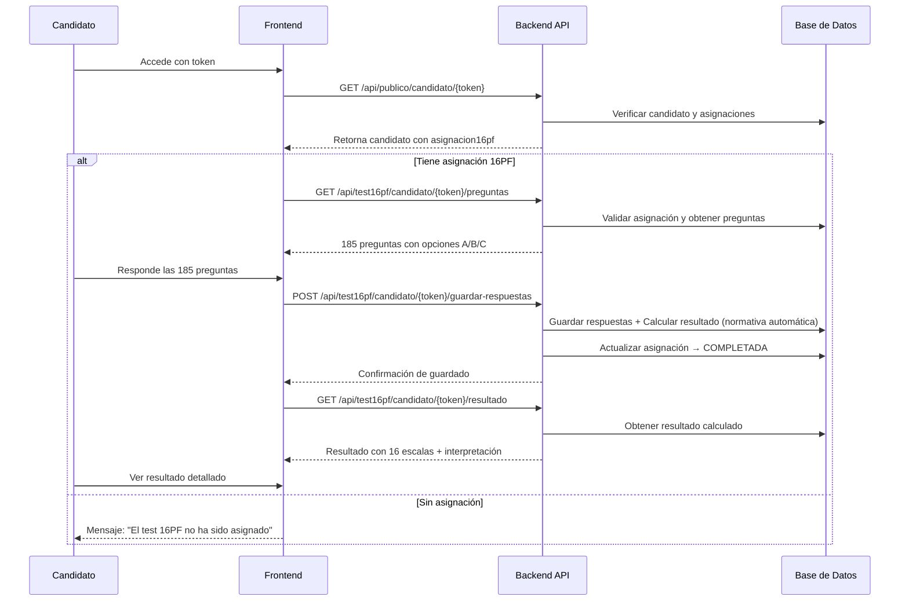

# Test 16PF - Guía de Consumo para Frontend

## Descripción General

Este documento describe cómo consumir los endpoints del test 16PF desde el frontend, tanto para el flujo del candidato como para el panel administrativo del psicólogo.

---

## 🎯 Flujo Completo del Candidato



---

## 📋 Endpoints Disponibles

### Base URL
```
http://localhost:5208/api/test16pf
```

---

## 1. Obtener Preguntas del Test 16PF

### `GET /api/test16pf/candidato/{token}/preguntas`

Obtiene las 185 preguntas del test 16PF con sus 3 opciones cada una.

**Requisitos previos:**
- ✅ El test 16PF debe estar asignado al candidato
- ✅ La asignación debe estar en estado "PENDIENTE"
- ✅ El candidato no debe haber respondido previamente
- ✅ La asignación no debe estar expirada (30 días)

**Path Parameters:**
- `token` (string): Token único del candidato

**Respuesta exitosa (200):**
```json
{
  "success": true,
  "message": "Preguntas del test 16PF obtenidas exitosamente",
  "data": {
    "preguntas": [
      {
        "pfpIdPregunta": 1,
        "pfpNumeroPregunta": 1,
        "pfpTextoPregunta": "Me gusta conocer a todos en una fiesta.",
        "pfpOpcionA": "Verdadero",
        "pfpOpcionB": "?",
        "pfpOpcionC": "Falso"
      },
      {
        "pfpIdPregunta": 2,
        "pfpNumeroPregunta": 2,
        "pfpTextoPregunta": "Podría manejar un barco en una tormenta.",
        "pfpOpcionA": "Sí",
        "pfpOpcionB": "Intermedio",
        "pfpOpcionC": "No"
      },
      ...
      {
        "pfpIdPregunta": 185,
        "pfpNumeroPregunta": 185,
        "pfpTextoPregunta": "Me siento tenso cuando pienso en mi trabajo del día.",
        "pfpOpcionA": "Verdadero",
        "pfpOpcionB": "?",
        "pfpOpcionC": "Falso"
      }
    ],
    "totalPreguntas": 185
  },
  "metadata": {
    "asignacion": {
      "estado": "PENDIENTE",
      "fechaAsignacion": "2025-11-20T15:00:00Z",
      "fechaLimite": "2025-12-20T15:00:00Z"
    }
  }
}
```

**Errores comunes:**

| Código | Mensaje | Solución |
|--------|---------|----------|
| 404 | "No tienes asignado el test 16PF" | El psicólogo debe asignar el test manualmente |
| 400 | "Ya completaste el test 16PF" | El test ya fue respondido; solo puede ver resultado |
| 400 | "Tu asignación del test 16PF ha expirado" | Contactar al psicólogo para reasignar |
| 400 | "Ya has respondido el test 16PF anteriormente" | Doble validación de completitud |

**Ejemplo de consumo:**

```typescript
interface Pregunta16pf {
  pfpIdPregunta: number;
  pfpNumeroPregunta: number;
  pfpTextoPregunta: string;
  pfpOpcionA: string | null;
  pfpOpcionB: string | null;
  pfpOpcionC: string | null;
}

interface Test16pfResponse {
  success: boolean;
  message: string;
  data: {
    preguntas: Pregunta16pf[];
    totalPreguntas: number;
  };
  metadata?: {
    asignacion: {
      estado: string;
      fechaAsignacion: string;
      fechaLimite: string;
    };
  };
}

async function obtenerPreguntas16pf(token: string): Promise<Pregunta16pf[]> {
  try {
    const response = await fetch(`/api/test16pf/candidato/${token}/preguntas`);
    
    if (!response.ok) {
      const error = await response.json();
      throw new Error(error.message || 'Error al obtener preguntas');
    }
    
    const result: Test16pfResponse = await response.json();
    
    if (!result.success || result.data.totalPreguntas !== 185) {
      throw new Error('El test no contiene las 185 preguntas requeridas');
    }
    
    return result.data.preguntas;
  } catch (error) {
    console.error('Error:', error);
    throw error;
  }
}
```

---

## 2. Obtener Escalas del Test 16PF (Opcional)

### `GET /api/test16pf/escalas`

Obtiene información sobre las 16 escalas primarias + 3 escalas de validez.

**Uso:** Mostrar información educativa al candidato antes de iniciar el test.

**No requiere autenticación**

**Respuesta exitosa (200):**
```json
{
  "success": true,
  "message": "Escalas del test 16PF obtenidas exitosamente",
  "data": [
    {
      "escIdEscala": 1,
      "escCodigo": "A",
      "escNombre": "Afabilidad",
      "escDescripcion": "Mide la calidez y cordialidad en las relaciones interpersonales",
      "escPoloBajo": "Reservado, Distante, Frío",
      "escPoloAlto": "Cálido, Afable, Generoso",
      "escActivo": true
    },
    {
      "escIdEscala": 2,
      "escCodigo": "B",
      "escNombre": "Razonamiento",
      "escDescripcion": "Capacidad de razonamiento abstracto y pensamiento lógico",
      "escPoloBajo": "Pensamiento concreto",
      "escPoloAlto": "Pensamiento abstracto",
      "escActivo": true
    },
    ...
    {
      "escIdEscala": 19,
      "escCodigo": "MI",
      "escNombre": "Manipulación de la imagen",
      "escDescripcion": "Escala de validez - Detecta respuestas socialmente deseables",
      "escPoloBajo": null,
      "escPoloAlto": null,
      "escActivo": true
    }
  ]
}
```

**Ejemplo de consumo:**

```typescript
interface Escala16pf {
  escIdEscala: number;
  escCodigo: string;
  escNombre: string;
  escDescripcion: string | null;
  escPoloBajo: string | null;
  escPoloAlto: string | null;
  escActivo: boolean;
}

async function obtenerEscalas16pf(): Promise<Escala16pf[]> {
  const response = await fetch('/api/test16pf/escalas');
  const result = await response.json();
  
  if (!result.success) {
    throw new Error(result.message);
  }
  
  return result.data;
}
```

---

## 3. Guardar Respuestas del Test 16PF

### `POST /api/test16pf/candidato/{token}/guardar-respuestas`

Envía las 185 respuestas del candidato. El sistema calcula automáticamente el resultado aplicando la normativa según el género del candidato.

**Path Parameters:**
- `token` (string): Token único del candidato

**Request Body:**
```json
{
  "candidatoId": 21,
  "respuestas": [
    { "preguntaId": 1, "valorRespuesta": 2 },
    { "preguntaId": 2, "valorRespuesta": 1 },
    { "preguntaId": 3, "valorRespuesta": 3 },
    ...
    { "preguntaId": 185, "valorRespuesta": 2 }
  ]
}
```

**Campos:**
- `candidatoId` (int): ID del candidato (debe coincidir con el token)
- `respuestas` (array): Array con exactamente 185 respuestas
  - `preguntaId` (int): ID de la pregunta (1-185)
  - `valorRespuesta` (int): Valor de la respuesta (1, 2 o 3)
    - **1**: Opción A
    - **2**: Opción B
    - **3**: Opción C

**Validaciones automáticas:**
- ✅ Exactamente 185 respuestas
- ✅ Valores entre 1 y 3
- ✅ No puede haber preguntas duplicadas
- ✅ El candidato no debe haber respondido previamente
- ✅ Asignación debe estar PENDIENTE y no expirada

**Respuesta exitosa (200):**
```json
{
  "success": true,
  "message": "¡Test 16PF completado exitosamente! Tus respuestas han sido guardadas y los resultados calculados.",
  "data": {
    "candidatoId": 21,
    "nombreCompleto": "Felipe Buitrago",
    "fechaRespuesta": "2025-11-20T18:30:00Z",
    "totalRespuestas": 185
  }
}
```

**Proceso automático al guardar:**
1. ✅ Valida las 185 respuestas
2. 🔄 Determina normativa automáticamente según género (M/F)
3. 💾 Guarda respuestas en `SEL_16PF_RESPUESTA_CANDIDATO`
4. 🧮 Calcula Puntuaciones Directas (PD) por escala
5. 📊 Convierte PD a Decatipos usando tabla normativa
6. 📝 Genera interpretación (BAJO/MEDIO/ALTO)
7. 💾 Almacena resultado en `SEL_16PF_RESULTADO_CANDIDATO`
8. 💾 Almacena resultados por escala en `SEL_16PF_RESULTADO_ESCALA`
9. ✅ Marca asignación como COMPLETADA
10. 📝 Registra tipo de normativa aplicado en la asignación (trazabilidad)

**Normativa Automática:**
| Género | Normativa Aplicada |
|--------|-------------------|
| Masculino (M) | "Masculino - 16PF" |
| Femenino (F) | "Femenino - 16PF" |
| No especificado | "Masculino - 16PF" (fallback) |

**Ejemplo de consumo:**

```typescript
interface Respuesta16pf {
  preguntaId: number;
  valorRespuesta: number; // 1, 2 o 3
}

interface GuardarRespuestasDto {
  candidatoId: number;
  respuestas: Respuesta16pf[];
}

interface GuardarRespuestasResponse {
  success: boolean;
  message: string;
  data: {
    candidatoId: number;
    nombreCompleto: string;
    fechaRespuesta: string;
    totalRespuestas: number;
  };
}

async function guardarRespuestas16pf(
  token: string,
  candidatoId: number,
  respuestas: Map<number, number> // preguntaId → valorRespuesta
): Promise<GuardarRespuestasResponse> {
  
  // Validar que tengamos 185 respuestas
  if (respuestas.size !== 185) {
    throw new Error(`Se requieren 185 respuestas. Recibidas: ${respuestas.size}`);
  }
  
  // Convertir Map a array
  const respuestasArray: Respuesta16pf[] = Array.from(respuestas.entries()).map(
    ([preguntaId, valorRespuesta]) => ({
      preguntaId,
      valorRespuesta
    })
  );
  
  // Validar valores (1-3)
  const valoresInvalidos = respuestasArray.filter(
    r => r.valorRespuesta < 1 || r.valorRespuesta > 3
  );
  
  if (valoresInvalidos.length > 0) {
    throw new Error('Todas las respuestas deben tener valores entre 1 y 3');
  }
  
  const body: GuardarRespuestasDto = {
    candidatoId,
    respuestas: respuestasArray
  };
  
  try {
    const response = await fetch(
      `/api/test16pf/candidato/${token}/guardar-respuestas`,
      {
        method: 'POST',
        headers: {
          'Content-Type': 'application/json'
        },
        body: JSON.stringify(body)
      }
    );
    
    if (!response.ok) {
      const error = await response.json();
      throw new Error(error.message || 'Error al guardar respuestas');
    }
    
    const result: GuardarRespuestasResponse = await response.json();
    return result;
  } catch (error) {
    console.error('Error guardando respuestas:', error);
    throw error;
  }
}
```

---

## 4. Obtener Resultado del Test 16PF

### `GET /api/test16pf/candidato/{token}/resultado`

Obtiene el resultado calculado del test 16PF con las 16 escalas primarias + 3 escalas de validez.

**Path Parameters:**
- `token` (string): Token único del candidato

**Requisitos:**
- El candidato debe haber completado el test

**Respuesta exitosa (200):**
```json
{
  "success": true,
  "message": "Resultado del test 16PF obtenido exitosamente",
  "data": {
    "candidatoId": 21,
    "nombreCandidato": "Felipe Buitrago",
    "tipoNormativa": "Masculino - 16PF",
    "generoAplicado": "M",
    "totalRespuestas": 185,
    "fechaAplicacion": "2025-11-20T18:30:00Z",
    "escalas": [
      {
        "codigoEscala": "A",
        "nombreEscala": "Afabilidad",
        "poloBajo": "Reservado, Distante, Frío",
        "poloAlto": "Cálido, Afable, Generoso",
        "puntuacionDirecta": 12,
        "decatipo": 6,
        "interpretacion": "MEDIO"
      },
      {
        "codigoEscala": "B",
        "nombreEscala": "Razonamiento",
        "poloBajo": "Pensamiento concreto",
        "poloAlto": "Pensamiento abstracto",
        "puntuacionDirecta": 8,
        "decatipo": 7,
        "interpretacion": "MEDIO"
      },
      {
        "codigoEscala": "C",
        "nombreEscala": "Estabilidad emocional",
        "poloBajo": "Reactivo, Emocionalmente cambiante",
        "poloAlto": "Emocionalmente estable, Adaptado, Maduro",
        "puntuacionDirecta": 15,
        "decatipo": 8,
        "interpretacion": "ALTO"
      },
      ...
      {
        "codigoEscala": "Q4",
        "nombreEscala": "Tensión",
        "poloBajo": "Relajado, Plácido, Paciente",
        "poloAlto": "Tenso, Impaciente, Irritable",
        "puntuacionDirecta": 18,
        "decatipo": 9,
        "interpretacion": "ALTO"
      },
      {
        "codigoEscala": "MI",
        "nombreEscala": "Manipulación de la imagen",
        "poloBajo": null,
        "poloAlto": null,
        "puntuacionDirecta": 5,
        "decatipo": 5,
        "interpretacion": "MEDIO"
      },
      {
        "codigoEscala": "IN",
        "nombreEscala": "Infrecuencia",
        "poloBajo": null,
        "poloAlto": null,
        "puntuacionDirecta": 2,
        "decatipo": 4,
        "interpretacion": "MEDIO"
      },
      {
        "codigoEscala": "AQ",
        "nombreEscala": "Aquiescencia",
        "poloBajo": null,
        "poloAlto": null,
        "puntuacionDirecta": 92,
        "decatipo": 5,
        "interpretacion": "MEDIO"
      }
    ]
  }
}
```

**Interpretación de Decatipos:**
| Decatipo | Interpretación | Descripción |
|----------|----------------|-------------|
| 1-3 | BAJO | Puntuación baja en la escala |
| 4-7 | MEDIO | Puntuación promedio/normal |
| 8-10 | ALTO | Puntuación alta en la escala |

**Ejemplo de consumo:**

```typescript
interface ResultadoEscala16pf {
  codigoEscala: string;
  nombreEscala: string;
  poloBajo: string | null;
  poloAlto: string | null;
  puntuacionDirecta: number;
  decatipo: number;
  interpretacion: string; // "BAJO" | "MEDIO" | "ALTO"
}

interface ResultadoCompleto16pf {
  candidatoId: number;
  nombreCandidato: string;
  tipoNormativa: string;
  generoAplicado: string | null;
  totalRespuestas: number;
  fechaAplicacion: string;
  escalas: ResultadoEscala16pf[];
}

interface ResultadoResponse {
  success: boolean;
  message: string;
  data: ResultadoCompleto16pf;
}

async function obtenerResultado16pf(token: string): Promise<ResultadoCompleto16pf> {
  try {
    const response = await fetch(`/api/test16pf/candidato/${token}/resultado`);
    
    if (!response.ok) {
      const error = await response.json();
      throw new Error(error.message || 'Error al obtener resultado');
    }
    
    const result: ResultadoResponse = await response.json();
    
    if (!result.success) {
      throw new Error(result.message);
    }
    
    return result.data;
  } catch (error) {
    console.error('Error:', error);
    throw error;
  }
}
```

---

## 5. Recalcular Resultado (Opcional)

### `POST /api/test16pf/candidato/{token}/recalcular`

Recalcula el resultado aplicando la normativa correcta según el género actual del candidato.

**Cuándo usar:**
- Se corrigió el género del candidato
- Se actualizaron las tablas normativas
- Re-procesamiento por errores de cálculo

**Path Parameters:**
- `token` (string): Token único del candidato

**No requiere body** (la normativa se determina automáticamente)

**Respuesta exitosa (200):**
```json
{
  "success": true,
  "message": "Resultado recalculado exitosamente con la normativa apropiada según tu género.",
  "data": {
    "candidatoId": 21,
    "nombreCompleto": "Felipe Buitrago",
    "fechaRecalculo": "2025-11-20T19:00:00Z"
  }
}
```

**Ejemplo de consumo:**

```typescript
async function recalcularResultado16pf(token: string): Promise<void> {
  const response = await fetch(
    `/api/test16pf/candidato/${token}/recalcular`,
    { method: 'POST' }
  );
  
  if (!response.ok) {
    const error = await response.json();
    throw new Error(error.message);
  }
  
  const result = await response.json();
  console.log(result.message);
}
```

---

## 🎨 Componentes UI Recomendados

### Componente: Renderizar Pregunta

```tsx
interface Pregunta16pfProps {
  pregunta: Pregunta16pf;
  respuestaActual: number | null;
  onRespuesta: (preguntaId: number, valor: number) => void;
  numeroPregunta: number;
}

function Pregunta16pfComponent({ 
  pregunta, 
  respuestaActual, 
  onRespuesta,
  numeroPregunta 
}: Pregunta16pfProps) {
  return (
    <div className="pregunta-16pf">
      <h3>Pregunta {numeroPregunta} de 185</h3>
      <p className="enunciado">{pregunta.pfpTextoPregunta}</p>
      
      <div className="opciones">
        <label className={respuestaActual === 1 ? 'selected' : ''}>
          <input 
            type="radio"
            name={`pregunta-${pregunta.pfpIdPregunta}`}
            value={1}
            checked={respuestaActual === 1}
            onChange={() => onRespuesta(pregunta.pfpIdPregunta, 1)}
          />
          <span>A. {pregunta.pfpOpcionA}</span>
        </label>
        
        <label className={respuestaActual === 2 ? 'selected' : ''}>
          <input 
            type="radio"
            name={`pregunta-${pregunta.pfpIdPregunta}`}
            value={2}
            checked={respuestaActual === 2}
            onChange={() => onRespuesta(pregunta.pfpIdPregunta, 2)}
          />
          <span>B. {pregunta.pfpOpcionB}</span>
        </label>
        
        <label className={respuestaActual === 3 ? 'selected' : ''}>
          <input 
            type="radio"
            name={`pregunta-${pregunta.pfpIdPregunta}`}
            value={3}
            checked={respuestaActual === 3}
            onChange={() => onRespuesta(pregunta.pfpIdPregunta, 3)}
          />
          <span>C. {pregunta.pfpOpcionC}</span>
        </label>
      </div>
    </div>
  );
}
```

### Componente: Barra de Progreso

```tsx
interface ProgresoTestProps {
  totalPreguntas: number;
  preguntasRespondidas: number;
}

function ProgresoTest({ totalPreguntas, preguntasRespondidas }: ProgresoTestProps) {
  const porcentaje = (preguntasRespondidas / totalPreguntas) * 100;
  
  return (
    <div className="progreso-test">
      <div className="progreso-info">
        <span>{preguntasRespondidas} / {totalPreguntas} preguntas respondidas</span>
        <span>{porcentaje.toFixed(1)}%</span>
      </div>
      <div className="progreso-barra">
        <div 
          className="progreso-relleno" 
          style={{ width: `${porcentaje}%` }}
        />
      </div>
    </div>
  );
}
```

### Componente: Vista de Resultado

```tsx
interface ResultadoEscalaCardProps {
  escala: ResultadoEscala16pf;
}

function ResultadoEscalaCard({ escala }: ResultadoEscalaCardProps) {
  const getColorInterpretacion = (interpretacion: string) => {
    switch (interpretacion) {
      case 'BAJO': return 'blue';
      case 'MEDIO': return 'gray';
      case 'ALTO': return 'orange';
      default: return 'gray';
    }
  };
  
  const color = getColorInterpretacion(escala.interpretacion);
  
  return (
    <div className="escala-card">
      <div className="escala-header">
        <h4>{escala.codigoEscala} - {escala.nombreEscala}</h4>
        <span className={`badge badge-${color}`}>
          {escala.interpretacion}
        </span>
      </div>
      
      {escala.poloBajo && escala.poloAlto && (
        <div className="escala-polos">
          <div className="polo polo-bajo">
            <span className="label">Polo Bajo:</span>
            <span>{escala.poloBajo}</span>
          </div>
          <div className="polo polo-alto">
            <span className="label">Polo Alto:</span>
            <span>{escala.poloAlto}</span>
          </div>
        </div>
      )}
      
      <div className="escala-valores">
        <div className="valor">
          <span className="label">Puntuación Directa:</span>
          <strong>{escala.puntuacionDirecta}</strong>
        </div>
        <div className="valor">
          <span className="label">Decatipo:</span>
          <strong>{escala.decatipo}/10</strong>
        </div>
      </div>
      
      <div className="decatipo-barra">
        <div 
          className="decatipo-indicador"
          style={{ left: `${(escala.decatipo / 10) * 100}%` }}
        />
      </div>
    </div>
  );
}

function VistaResultado16pf({ resultado }: { resultado: ResultadoCompleto16pf }) {
  // Separar escalas primarias y de validez
  const escalasFactores = ['A', 'B', 'C', 'E', 'F', 'G', 'H', 'I', 'L', 'M', 'N', 'O', 'Q1', 'Q2', 'Q3', 'Q4'];
  const escalasPrimarias = resultado.escalas.filter(e => escalasFactores.includes(e.codigoEscala));
  const escalasValidez = resultado.escalas.filter(e => ['MI', 'IN', 'AQ'].includes(e.codigoEscala));
  
  return (
    <div className="resultado-16pf">
      <div className="resultado-header">
        <h2>Resultado del Test 16PF</h2>
        <div className="resultado-meta">
          <p><strong>Candidato:</strong> {resultado.nombreCandidato}</p>
          <p><strong>Fecha:</strong> {new Date(resultado.fechaAplicacion).toLocaleDateString()}</p>
          <p><strong>Normativa aplicada:</strong> {resultado.tipoNormativa}</p>
          <p><strong>Total de respuestas:</strong> {resultado.totalRespuestas}</p>
        </div>
      </div>
      
      <section className="escalas-primarias">
        <h3>Escalas Primarias (16 Factores)</h3>
        <div className="escalas-grid">
          {escalasPrimarias.map(escala => (
            <ResultadoEscalaCard key={escala.codigoEscala} escala={escala} />
          ))}
        </div>
      </section>
      
      <section className="escalas-validez">
        <h3>Escalas de Validez</h3>
        <div className="escalas-grid">
          {escalasValidez.map(escala => (
            <ResultadoEscalaCard key={escala.codigoEscala} escala={escala} />
          ))}
        </div>
      </section>
    </div>
  );
}
```

### Componente: Flujo Completo del Test

```tsx
import { useState, useEffect } from 'react';

function Test16pfFlow({ token }: { token: string }) {
  const [preguntas, setPreguntas] = useState<Pregunta16pf[]>([]);
  const [respuestas, setRespuestas] = useState<Map<number, number>>(new Map());
  const [preguntaActual, setPreguntaActual] = useState(0);
  const [loading, setLoading] = useState(true);
  const [guardando, setGuardando] = useState(false);
  const [error, setError] = useState<string | null>(null);
  const [candidatoId, setCandidatoId] = useState<number | null>(null);
  
  // Cargar candidato y verificar asignación
  useEffect(() => {
    async function cargarCandidato() {
      try {
        const response = await fetch(`/api/publico/candidato/${token}`);
        const result = await response.json();
        
        if (!result.success) {
          throw new Error(result.message);
        }
        
        setCandidatoId(result.data.canId);
        
        // Verificar asignación 16PF
        if (!result.data.asignacion16pf) {
          setError('El test 16PF no ha sido asignado. Contacta al psicólogo.');
          setLoading(false);
          return;
        }
        
        if (result.data.asignacion16pf.pruebaCompletada) {
          setError('Ya completaste el test 16PF. Puedes ver tu resultado.');
          setLoading(false);
          return;
        }
        
        // Cargar preguntas
        await cargarPreguntas();
      } catch (err: any) {
        setError(err.message || 'Error al cargar datos');
        setLoading(false);
      }
    }
    
    cargarCandidato();
  }, [token]);
  
  async function cargarPreguntas() {
    try {
      const preguntasData = await obtenerPreguntas16pf(token);
      setPreguntas(preguntasData);
      setLoading(false);
    } catch (err: any) {
      setError(err.message || 'Error al cargar preguntas');
      setLoading(false);
    }
  }
  
  const handleRespuesta = (preguntaId: number, valor: number) => {
    setRespuestas(prev => new Map(prev).set(preguntaId, valor));
  };
  
  const handleSiguiente = () => {
    if (preguntaActual < preguntas.length - 1) {
      setPreguntaActual(prev => prev + 1);
    }
  };
  
  const handleAnterior = () => {
    if (preguntaActual > 0) {
      setPreguntaActual(prev => prev - 1);
    }
  };
  
  const handleEnviar = async () => {
    if (respuestas.size !== 185) {
      alert(`Faltan ${185 - respuestas.size} preguntas por responder`);
      return;
    }
    
    if (!candidatoId) {
      alert('Error: ID de candidato no disponible');
      return;
    }
    
    if (!confirm('¿Estás seguro de enviar tus respuestas? No podrás modificarlas después.')) {
      return;
    }
    
    setGuardando(true);
    
    try {
      await guardarRespuestas16pf(token, candidatoId, respuestas);
      alert('¡Test completado exitosamente! Tus respuestas han sido guardadas.');
      // Redirigir a página de resultado
      window.location.href = `/resultado-16pf?token=${token}`;
    } catch (err: any) {
      alert(err.message || 'Error al guardar respuestas');
      setGuardando(false);
    }
  };
  
  if (loading) {
    return <div className="loading">Cargando test...</div>;
  }
  
  if (error) {
    return (
      <div className="error-message">
        <h3>No se puede acceder al test</h3>
        <p>{error}</p>
      </div>
    );
  }
  
  const pregunta = preguntas[preguntaActual];
  const respuestaActual = respuestas.get(pregunta.pfpIdPregunta) || null;
  
  return (
    <div className="test-16pf-container">
      <ProgresoTest 
        totalPreguntas={185} 
        preguntasRespondidas={respuestas.size} 
      />
      
      <Pregunta16pfComponent
        pregunta={pregunta}
        respuestaActual={respuestaActual}
        onRespuesta={handleRespuesta}
        numeroPregunta={preguntaActual + 1}
      />
      
      <div className="navegacion">
        <button 
          onClick={handleAnterior}
          disabled={preguntaActual === 0}
        >
          ← Anterior
        </button>
        
        <span>{preguntaActual + 1} / 185</span>
        
        {preguntaActual < preguntas.length - 1 ? (
          <button onClick={handleSiguiente}>
            Siguiente →
          </button>
        ) : (
          <button 
            onClick={handleEnviar}
            disabled={guardando || respuestas.size !== 185}
            className="btn-enviar"
          >
            {guardando ? 'Enviando...' : 'Enviar Respuestas'}
          </button>
        )}
      </div>
      
      {respuestas.size !== 185 && (
        <div className="advertencia">
          ⚠️ Faltan {185 - respuestas.size} preguntas por responder
        </div>
      )}
    </div>
  );
}
```

---

## 🔒 Seguridad y Validaciones

### Validaciones del Backend

1. **Asignación obligatoria:** El candidato debe tener una asignación válida del test 16PF
2. **Estado PENDIENTE:** La asignación debe estar pendiente (no completada)
3. **Fecha límite:** La asignación no debe estar expirada (30 días desde asignación)
4. **Unicidad:** El candidato no puede responder el test más de una vez
5. **Integridad:** Exactamente 185 respuestas con valores 1-3
6. **Token válido:** El candidatoId del body debe coincidir con el token

### Validaciones del Frontend

```typescript
// Validación completa antes de enviar
function validarRespuestasAntesDe Enviar(
  respuestas: Map<number, number>,
  totalPreguntas: number
): { valido: boolean; errores: string[] } {
  const errores: string[] = [];
  
  // 1. Verificar cantidad
  if (respuestas.size !== totalPreguntas) {
    errores.push(`Se requieren ${totalPreguntas} respuestas. Tienes ${respuestas.size}.`);
  }
  
  // 2. Verificar valores válidos
  for (const [preguntaId, valor] of respuestas.entries()) {
    if (valor < 1 || valor > 3) {
      errores.push(`Pregunta ${preguntaId}: valor inválido (${valor}). Debe ser 1, 2 o 3.`);
    }
  }
  
  // 3. Verificar que no falten preguntas
  for (let i = 1; i <= totalPreguntas; i++) {
    if (!respuestas.has(i)) {
      errores.push(`Falta responder la pregunta ${i}`);
    }
  }
  
  return {
    valido: errores.length === 0,
    errores
  };
}
```

---

## 📝 Notas Importantes

### Normativa Automática
- ✅ **No es necesario** que el frontend envíe el `tipoNormativaId`
- ✅ El backend determina automáticamente la normativa según el género del candidato
- ✅ Si el género no está definido, usa normativa masculina por defecto
- ✅ La normativa aplicada queda registrada en la asignación para trazabilidad

### Tiempos y Límites
- ⏰ Tiempo recomendado: 40-50 minutos
- ⏰ Fecha límite: 30 días desde la asignación
- ⚠️ Después de expirada, el psicólogo debe reasignar manualmente

### Estados de Asignación
| Estado | Descripción | Acción del Candidato |
|--------|-------------|----------------------|
| PENDIENTE | Asignada pero no completada | Puede responder el test |
| COMPLETADA | Test respondido | Solo puede ver resultado |
| (Expirada) | Fecha límite superada | Contactar psicólogo |

### Persistencia Local (Opcional)
Para evitar pérdida de respuestas, puedes guardar en `localStorage`:

```typescript
// Guardar respuestas localmente mientras el candidato responde
function guardarRespuestasLocal(token: string, respuestas: Map<number, number>) {
  const key = `test16pf_respuestas_${token}`;
  const data = Array.from(respuestas.entries());
  localStorage.setItem(key, JSON.stringify(data));
}

// Recuperar respuestas si el navegador se cierra
function recuperarRespuestasLocal(token: string): Map<number, number> {
  const key = `test16pf_respuestas_${token}`;
  const stored = localStorage.getItem(key);
  
  if (!stored) return new Map();
  
  try {
    const data = JSON.parse(stored);
    return new Map(data);
  } catch {
    return new Map();
  }
}

// Limpiar después de enviar exitosamente
function limpiarRespuestasLocal(token: string) {
  const key = `test16pf_respuestas_${token}`;
  localStorage.removeItem(key);
}
```

---

## 🆘 Solución de Problemas

| Error | Causa | Solución |
|-------|-------|----------|
| "No tienes asignado el test 16PF" | Sin asignación | Solicitar al psicólogo que asigne el test |
| "Ya completaste el test 16PF" | Test ya respondido | Acceder a la vista de resultado |
| "Tu asignación ha expirado" | Pasaron > 30 días | Solicitar reasignación al psicólogo |
| "El ID del candidato no coincide" | Token inválido | Verificar que el token sea correcto |
| "Debes responder las 185 preguntas" | Faltan respuestas | Completar todas las preguntas |
| "Valor de respuesta inválido" | Valor fuera de rango 1-3 | Verificar que todas las respuestas sean 1, 2 o 3 |

---

## 📊 Ejemplo Completo de Flujo

```typescript
// main-test-16pf.ts
async function flujoCompleto16pf(token: string) {
  try {
    // 1. Verificar candidato y asignación
    console.log('1. Verificando candidato...');
    const candidatoResponse = await fetch(`/api/publico/candidato/${token}`);
    const candidatoData = await candidatoResponse.json();
    
    if (!candidatoData.success) {
      throw new Error('Candidato no encontrado');
    }
    
    const candidato = candidatoData.data;
    
    if (!candidato.asignacion16pf) {
      throw new Error('Test 16PF no asignado');
    }
    
    if (candidato.asignacion16pf.pruebaCompletada) {
      console.log('El test ya está completado. Mostrando resultado...');
      const resultado = await obtenerResultado16pf(token);
      mostrarResultado(resultado);
      return;
    }
    
    // 2. Obtener preguntas
    console.log('2. Obteniendo preguntas...');
    const preguntas = await obtenerPreguntas16pf(token);
    console.log(`✓ ${preguntas.length} preguntas cargadas`);
    
    // 3. Mostrar test al candidato
    mostrarTest(preguntas);
    
    // 4. Candidato responde (simulado aquí)
    console.log('3. Candidato respondiendo...');
    const respuestas = new Map<number, number>();
    
    // Simulación: responder todas con valor aleatorio entre 1-3
    preguntas.forEach(p => {
      const valorAleatorio = Math.floor(Math.random() * 3) + 1;
      respuestas.set(p.pfpIdPregunta, valorAleatorio);
    });
    
    console.log(`✓ ${respuestas.size} respuestas preparadas`);
    
    // 5. Enviar respuestas
    console.log('4. Enviando respuestas...');
    const resultadoGuardado = await guardarRespuestas16pf(
      token,
      candidato.canId,
      respuestas
    );
    console.log('✓ Respuestas guardadas:', resultadoGuardado.message);
    
    // 6. Obtener resultado
    console.log('5. Obteniendo resultado...');
    const resultado = await obtenerResultado16pf(token);
    console.log('✓ Resultado obtenido');
    
    // 7. Mostrar resultado
    mostrarResultado(resultado);
    
    console.log('✅ Flujo completado exitosamente');
    
  } catch (error) {
    console.error('❌ Error en el flujo:', error);
  }
}

// Ejecutar con un token válido
// flujoCompleto16pf('tu-token-aqui');
```

---

Para más información sobre el panel administrativo del psicólogo, consulta: `PANEL_PSICOLOGOS_FRONTEND.md`
